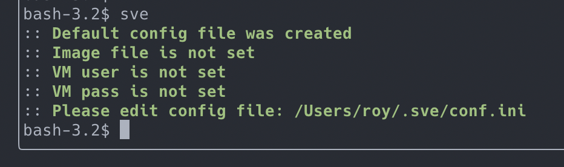
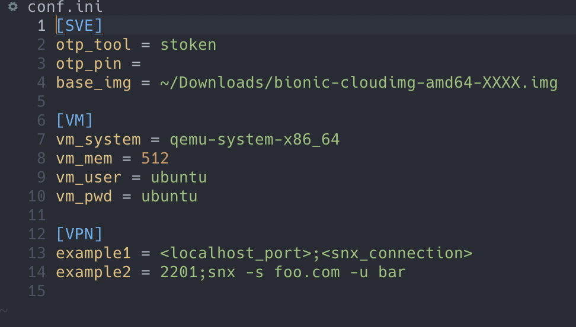

## SNX VPN Emulator

### Description

Simple CLI tool which can create a QEMU based VM with SNX preinstalled to support multiple VPN connections on host OS at the same time.

### What you'll need:

- python3:
    - tested with version 3.8, but can work with any 3.X ver;
    - *for macOS* can use :: `brew install python@3.8`;
    - or visit (<https://www.python.org/downloads>)
- python's pkgs:
    - to install use :: `pip install -r src/requirements.txt`;
    - or visit (<https://pypi.org/project/pexpect>)
- stoken cli tool:
    - *for macOS* can use :: `brew install stoken`;
    - or visit (<https://github.com/stoken-dev/stoken>);
    - **NOTE**: password for token decryption and PIN should be the same
- QEMU machine emulator:
    - *for macOS* can use :: `brew install qemu`;
    - or visit (<https://www.qemu.org>)
- SSH client:
    - as usual already in your system, but if not...;
    - *for macOS* can use :: `brew install openssh`;
    - or visit (<https://www.openssh.com/>)
- expect shell cli tool:
    - as usual already in your system, but if not...;
    - *for macOS* can use :: `brew install expect`;
    - or visit (<https://core.tcl-lang.org/expect/index>)
    
Not macOS user? You can use any pkg manager available on your system to install missing dependencies. Please refer to repo's search method to find matching pkg.

### Installation process:

1. Place **src/sve.py** in any ***bin*** folder which is a part of your $PATH (without .py extension):

    example:
    \
    `cp src/sve.py /usr/local/bin/sve`

2. Join and untar **src/img/bionic-cloudimg-amd64-XXXX.img.tar.bz2** in a folder of your choice:

    example:
    \
    `cat src/img/bionic-cloudimg-amd64_* > src/img/bionic-cloudimg-amd64-XXXX.img.tar.bz2`
    \
    `tar xjvf src/img/bionic-cloudimg-amd64-XXXX.img.tar.bz2 -C ~/Downloads/`

3. Run **sve** tool without any parameter to init app's home folder and default config file:

\

 
4. Edit conf.ini to set those basic settings:
   - `base_img` - path to extracted bionic-cloudimg-amd64-XXXX.img file;
   - `vm_user` and `vm_pwd` - login creds for img above (cloudimg provided has default one _ubuntu/ubuntu_);
   - `VPN` section - edit connections list like in available example:
     - `localhost_port` - it's a port on host system traffic to which will be forwarded to SNX VM;
     - `snx_connection`- snx connection string.

\

### Usage

- `sve -h` to see a help;
- `sve -gc` to get a config file path;
- `sve -c <connection_name>` to create/start VM with SNX connection inside and connect to it.
\
   macOS users can change app association for .command files (press `command + i` on a file and select new default app in "Open with" menu) so each connection will be opened in your favorite terminal emulator.

### Summary

> If using your own linux image, make sure its hostname contains `vpn-snx` substring (in most distros edit _/etc/hostname_).
> Change login credentials in conf.ini file if needed.

> stoken cli tool should be configured in a way to use one password for token decryption and PIN.

> Maybe there would be a tweak for Linux and Windows in the future.